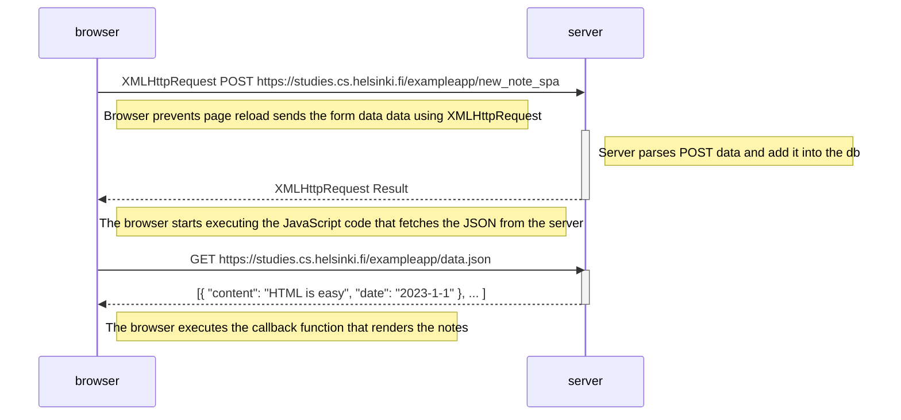

Sequence diagram when accessing notes but using an SPA.

```mermaid
sequenceDiagram
    participant browser
    participant server

    browser->>server: XMLHttpRequest POST https://studies.cs.helsinki.fi/exampleapp/new_note_spa
    Note right of browser: Browser prevents page reload sends the form data data using XMLHttpRequest
    activate server
    Note right of server: Server parses POST data and add it into the db
    server-->>browser: XMLHttpRequest Result
    deactivate server

    Note right of browser: The browser starts executing the JavaScript code that fetches the JSON from the server

    browser->>server: GET https://studies.cs.helsinki.fi/exampleapp/data.json
    activate server
    server-->>browser: [{ "content": "HTML is easy", "date": "2023-1-1" }, ... ]
    deactivate server

    Note right of browser: The browser executes the callback function that renders the notes
    
```