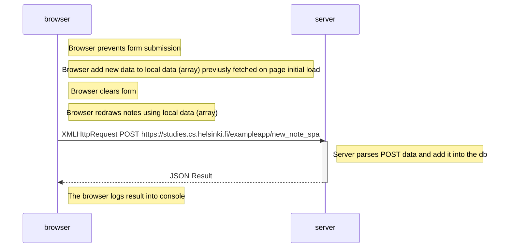

Sequence diagram when adding new notes but using an SPA.

```mermaid
sequenceDiagram
    participant browser
    participant server

    Note right of browser: Browser prevents form submission
    Note right of browser: Browser add new data to local data (array) previusly fetched on page initial load
    Note right of browser: Browser clears form
    Note right of browser: Browser redraws notes using local data (array)

    browser->>server: XMLHttpRequest POST https://studies.cs.helsinki.fi/exampleapp/new_note_spa
    activate server
    Note right of server: Server parses POST data and add it into the db
    server-->>browser: JSON Result
    deactivate server

    Note right of browser: The browser logs result into console
    
```